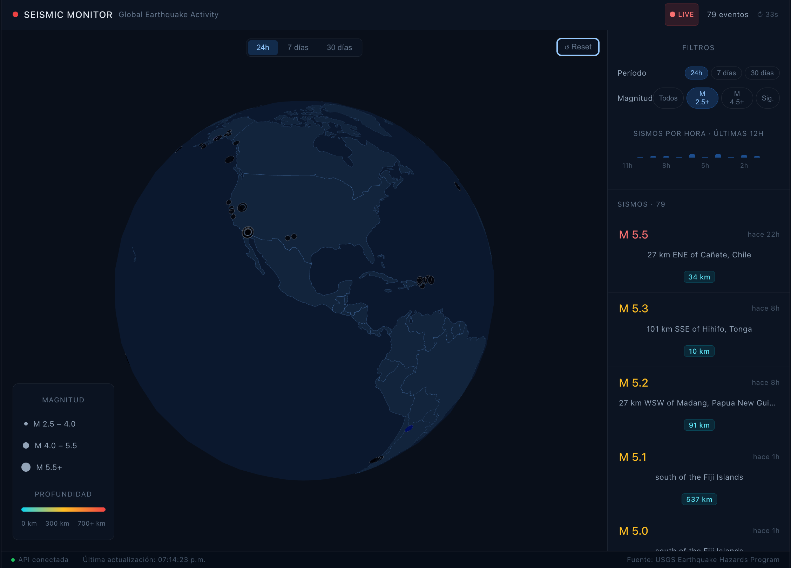

# Seismic Monitor

Real-time global earthquake activity monitor built with React, TypeScript and Deck.gl.



## Features

- 3D interactive globe with real-time earthquake data
- Points scaled by magnitude, colored by depth
- Automatic polling every 60 seconds
- Fly-to animation when selecting an earthquake
- Filter by time range and minimum magnitude
- Hourly frequency chart for the last 12 hours
- Live API status indicator

## Tech Stack

- **React 18** + **TypeScript** — UI and type safety
- **Deck.gl** — WebGL 3D globe rendering
- **React Query** — server state, caching and polling
- **Zustand** — client state management
- **Recharts** — data visualization
- **D3** — color and radius scales
- **Vite** — build tool

## Data Source

[USGS Earthquake Hazards Program](https://earthquake.usgs.gov/earthquakes/feed/v1.0/summary/) — public API, no key required.

## Getting Started

```bash
# Install dependencies
npm install

# Run development server
npm run dev

# Build for production
npm run build
```

## Project Structure

```
src/
├── api/          # USGS fetch and data transformation
├── components/
│   ├── map/      # Deck.gl globe, layers, legend, tabs
│   ├── sidebar/  # Filters, earthquake list, chart
│   └── ui/       # Topbar, statusbar, badge
├── hooks/        # useEarthquakes — React Query wrapper
├── store/        # Zustand filter store
├── types/        # TypeScript interfaces
└── utils/        # Color scale, formatters
```

## Author

dAlex Martínez
